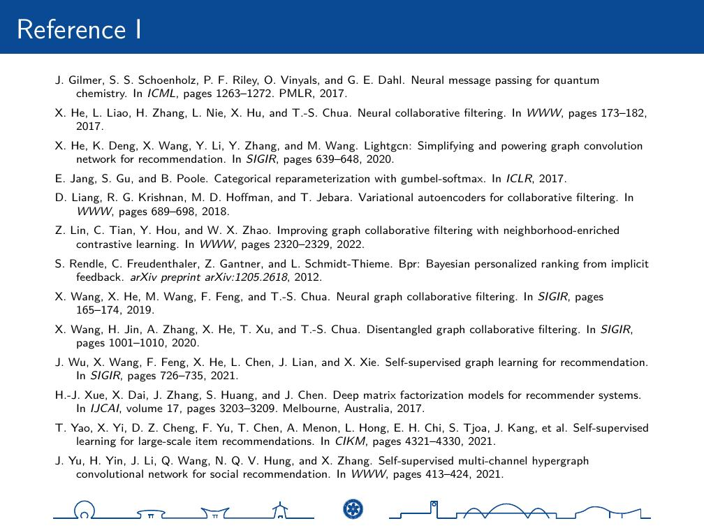

==================
Simple-UCAS-Beamer
==================

Simple UCAS Beamer (LaTeX)

Install
-------

Using Github
============

Download \ `beamerthemesimpleucas <https://github.com/huangjunjie-cs/simple-ucas-beamer/releases/latest/download/simple-ucas-theme.tar.gz>`_

.. code-block:: latex

   xelatex main.tex
   bibtex main
   xelatex main.tex
   xelatex main.tex
   latexmk -c

Features
--------

QA pages and Reference pages
==============================

Just use \ :code:`\refpage`\ and \ :code:`\qapage`\

See Example:

        

UCAS footer logo
================

