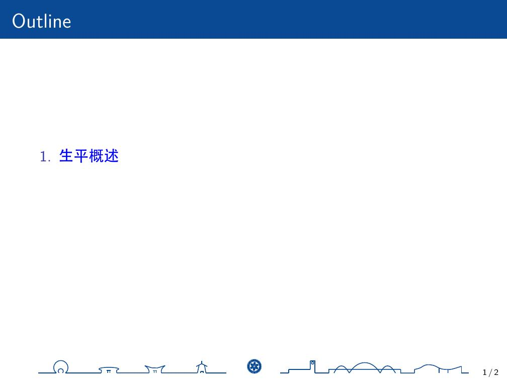
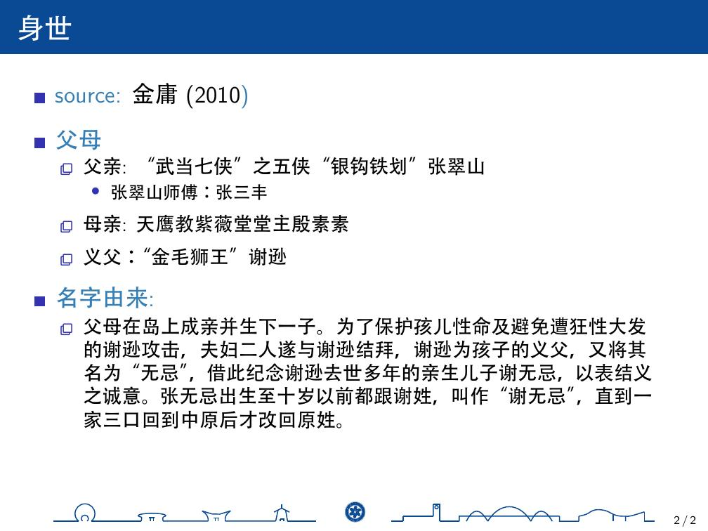
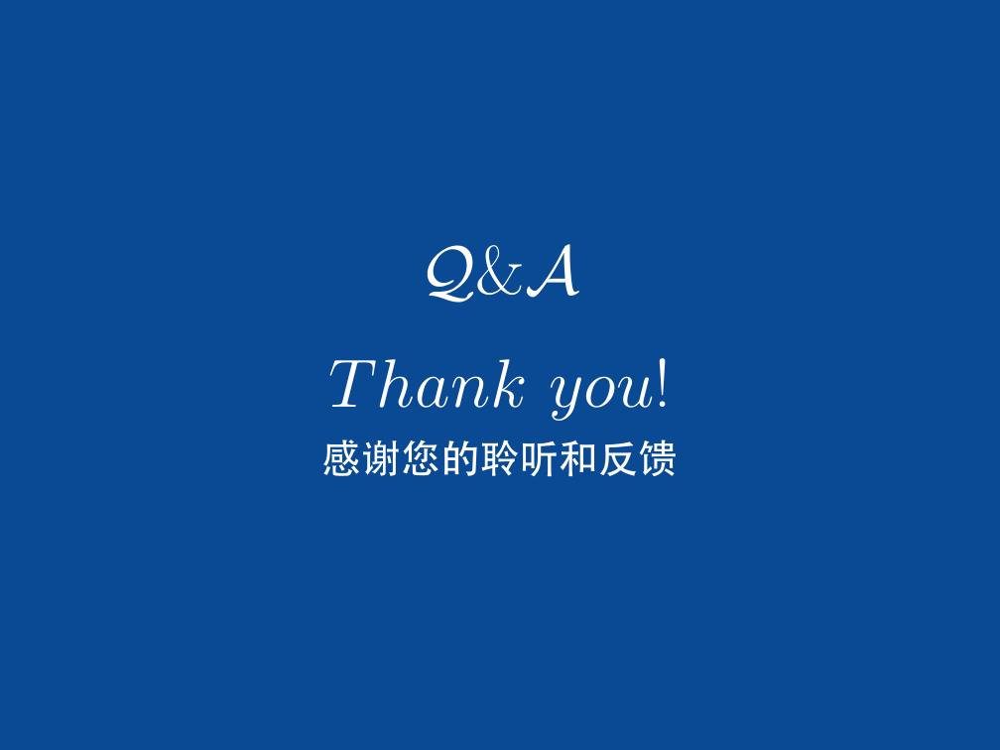
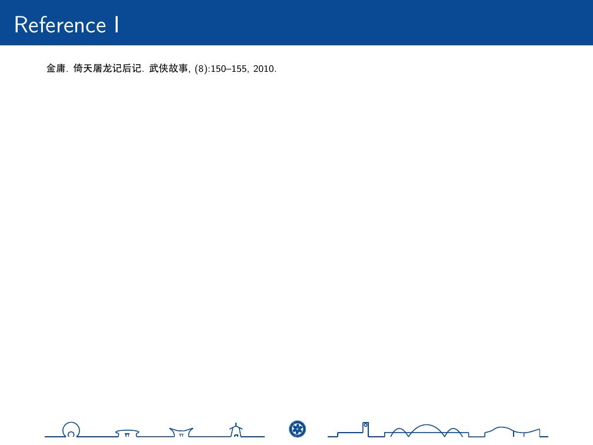

==================
Simple-UCAS-Beamer
==================

:: 
 
  UCAS (University of Chinese Academy of Sciences) is a renowned graduate school and research institution based in China. 
  It is a prominent institution directly affiliated with the Chinese Academy of Sciences (CAS).

  ----------- From ChatGPT

This is a simple beamer theme for UCAS. More information about this theme, see the \ `docs <https://huangjunjie-cs.github.io/simple-ucas-beamer/>`_.

Install
-------

Using Github
============

Download \ `beamerthemesimpleucas <https://github.com/huangjunjie-cs/simple-ucas-beamer/releases/latest/download/simple-ucas-theme.tar.gz>`_

.. code-block:: latex

   xelatex main.tex
   bibtex main
   xelatex main.tex
   xelatex main.tex
   latexmk -c

Examples
--------

.. figure:: docs/_static/imgs/zwj_0.jpg
   :alt: zwj 
        

