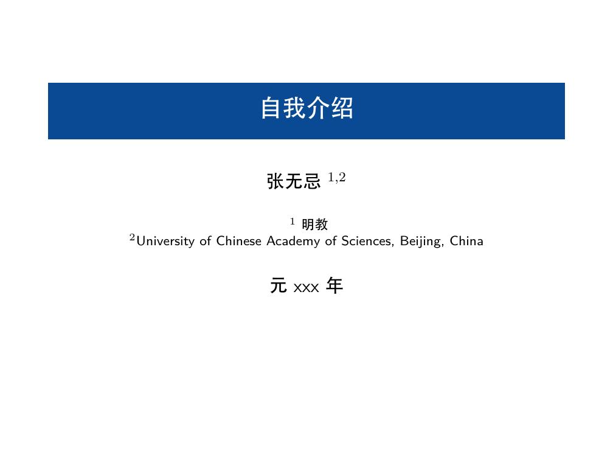

========
Features
========

Titlepage
=========

Just to note authors' information, and use \ :code:`\\titlepage`\

.. code-block:: latex

   \author{张无忌$^{1,2}$}
   
   \institute{
   $^{1}$ 明教 \\
   $^{2}$University of Chinese Academy of Sciences, Beijing, China \\
   }
   
   \date{元xxx年}
   
   \title{自我介绍}
   
   \begin{document}
   
   \titlepage

   ...

   \end{document}

You will get following page:

QA pages and Reference pages
==============================

Just use \ :code:`\\refpage`\ and \ :code:`\\qapage`\

.. grid:: 2

    .. grid-item-card:: \ :code:`\\qapage`\

        .. figure:: ../_static/imgs/example_27.jpg
           :alt: \ :code:`\qapage`\
        
           

    .. grid-item-card:: \ :code:`\\refpage`\
         
      .. figure:: ../_static/imgs/example_28.jpg
         :alt: \ :code:`\refpage`\

UCAS footer logo
================

This logo is inspired a picture from Wechat, but I plot it with simple lines using tikz.

.. figure:: ../../assets/footer_ucas_logo.png
   :alt: a footer ucas logo used in this project 

